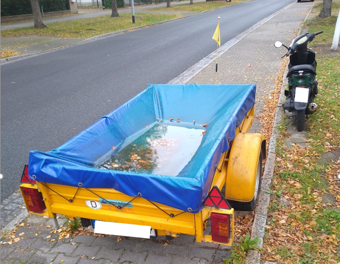

#### Advice: Do not get stuck in a local minimum:

Welcome to most important course you’ll ever take: **Data Science** 🙄
Here is my overview of the structure and contents of this unique blend
of stats/coding/machine learning: The first few weeks will focus on
<i>statistical thinking</i>, and I will lean heavily on the book
<a href="https://greenteapress.com/wp/think-stats-2e/" target="_blank">Think
Stats</a> (as well as the DataCamp
<a href="https://www.datacamp.com/courses/statistical-thinking-in-python-part-1"
        target="_blank">Statistical Thinking in Python</a>). From week 4
on, we will shift attention to basic concepts from machine learning and
rely more on the
<a href="https://www-bcf.usc.edu/~gareth/ISL/" target="_blank">ISLR
book</a> and the
<a href="https://www.datacamp.com/courses/supervised-learning-with-scikit-learn"
        target="_blank">sklearn</a> library. If time permits, I am
planning to cover the
<a href="http://makeyourownneuralnetwork.blogspot.com/" target="_blank">basics
of neural networks</a>.

## Course components

All lecture materials can be found on this
<a href="https://github.com/markusloecher/DataScience2021/" target="_blank">github
page</a> .

I am planning to teach in a *hybrid* mode this semester, i.e. some lectures will be online *BigBlueButton* (BBB) and some in-person.

The BBB live sessions will be recorded and can be found on the
corresponding link on moodle. I will also attempt to record zoom
sessions if there are any.

There will be a weekly homework assignment which is not graded. I
strongly recommend you to give your very best shot. I will provide
solutions and if you upload your homework, I will try to look over
it. 

## Grading

There will be a final exam at the end of the semester which counts
**70%** towards your grade. Due to the Corona uncertainties, I cannot
specify yet whether it will be taken online or at HWR. The remaining
**30%** of the total points are earned via the final project, which will
be tackled in groups of 4-5 and is typically a
<a href="https://www.kaggle.com/">kaggle </a>competition or a similar
data analysis task. The deliveries are a report and a final
presentation. We will start on this project in the middle of the
semester.

### Software and Environments

As this course is taught entirely in python, we will use Jupyter
notebooks frequently. At the same time -having worked with
<a href="www.rstudio.com/">Rstudio </a> for over a decade now- I feel
that the comfort of a proper IDE with its **many** powerful features is
vastly superior to the non ASCII notebooks. So I often will share with
you `.Rmd` (“Rmarkdown”) files that contain embedded python code. I
strongly encourage you to familiarize yourself with Rstudio as early as
possible.
