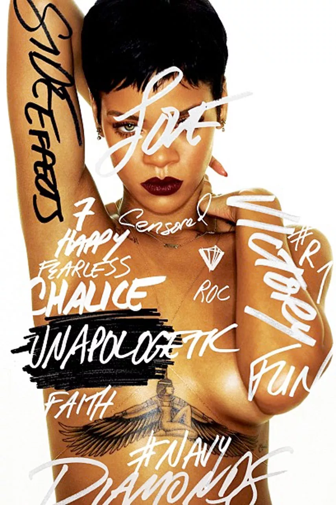

#### Advice: Do not get stuck in a local minimum:

#### Rihanna telling you how important ROC curves are

Welcome to most important course you’ll ever take: **Data Science** 🙄
Here is my overview of the structure and contents of this unique blend
of stats/coding/machine learning: The first few weeks will focus on
<i>statistical thinking</i>, and I will lean heavily on the book
<a href="https://greenteapress.com/wp/think-stats-2e/" target="_blank">Think
Stats</a> (as well as the DataCamp
<a href="https://www.datacamp.com/courses/statistical-thinking-in-python-part-1"
        target="_blank">Statistical Thinking in Python</a>). From week 3
on, we will shift attention to basic concepts from machine learning and
rely more on the
<a href="https://www-bcf.usc.edu/~gareth/ISL/" target="_blank">ISLR
book</a> and the
<a href="https://www.datacamp.com/courses/supervised-learning-with-scikit-learn"
        target="_blank">sklearn</a> library. If time permits, I am
planning to cover the
<a href="http://makeyourownneuralnetwork.blogspot.com/" target="_blank">basics
of neural networks</a>.

